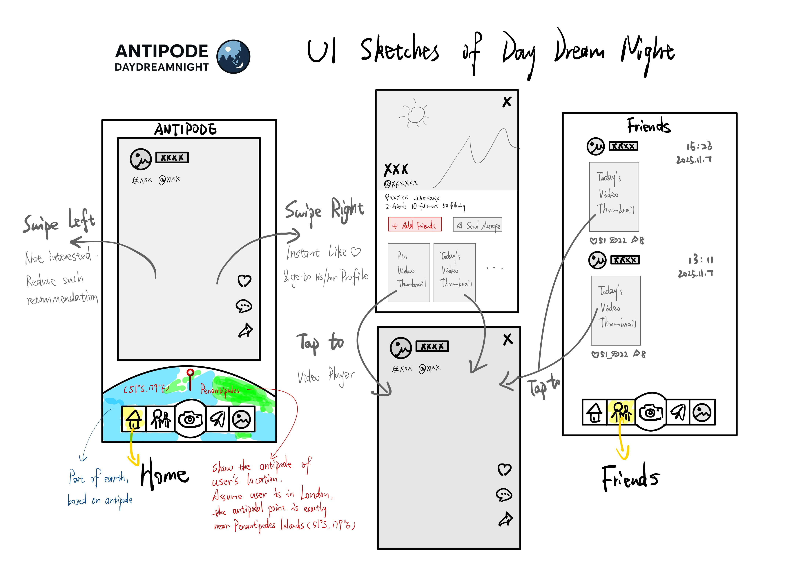
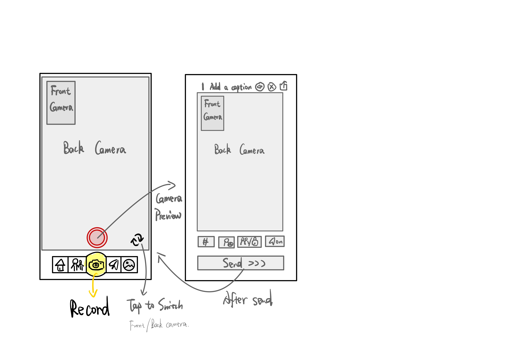
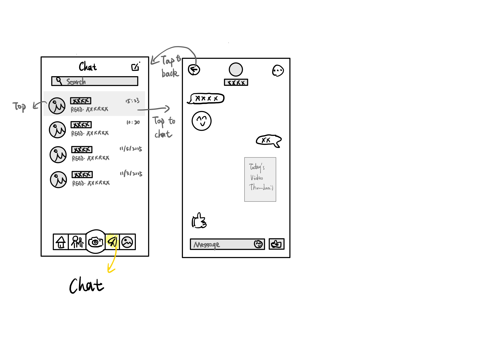
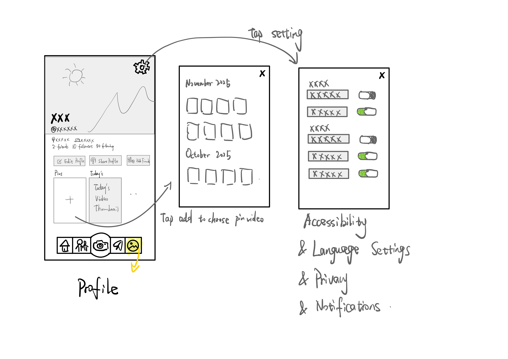

# Wireframe sketches 

These are the hand-drawn wireframe sketches for the DayDreamNight app.

## Overview

This project has five primary navigation pages: Home, Friends, Record, Chat, and Profile. Below each page has a short description of the layout and key elements used in the wireframes.

---

## 1. Home & 2. Friends

*Sketch 1 — ui_prototype_1_1.JPG*

---

## 3. Record

*Sketch 2 — ui_prototype_1_2.JPG*

---

## 4. Chat

*Sketch 3 — ui_prototype_1_3.JPG*

---

## 5. Profile

*Sketch 4 — ui_prototype_1_4.JPG*

---

## Document Status
**Version:** Sprint 0  
**Author:** Group 12 — Jiacheng Li 
**Status:** Approved for Sprint 1 development

---

