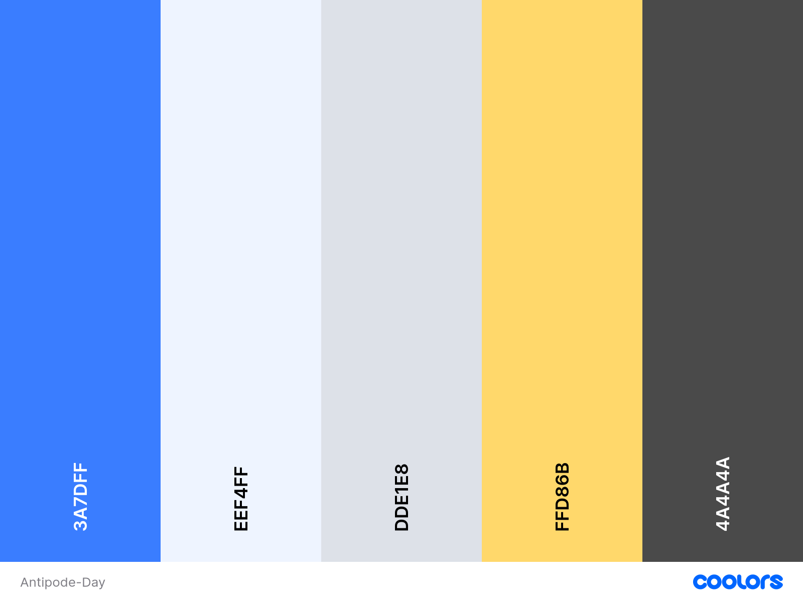
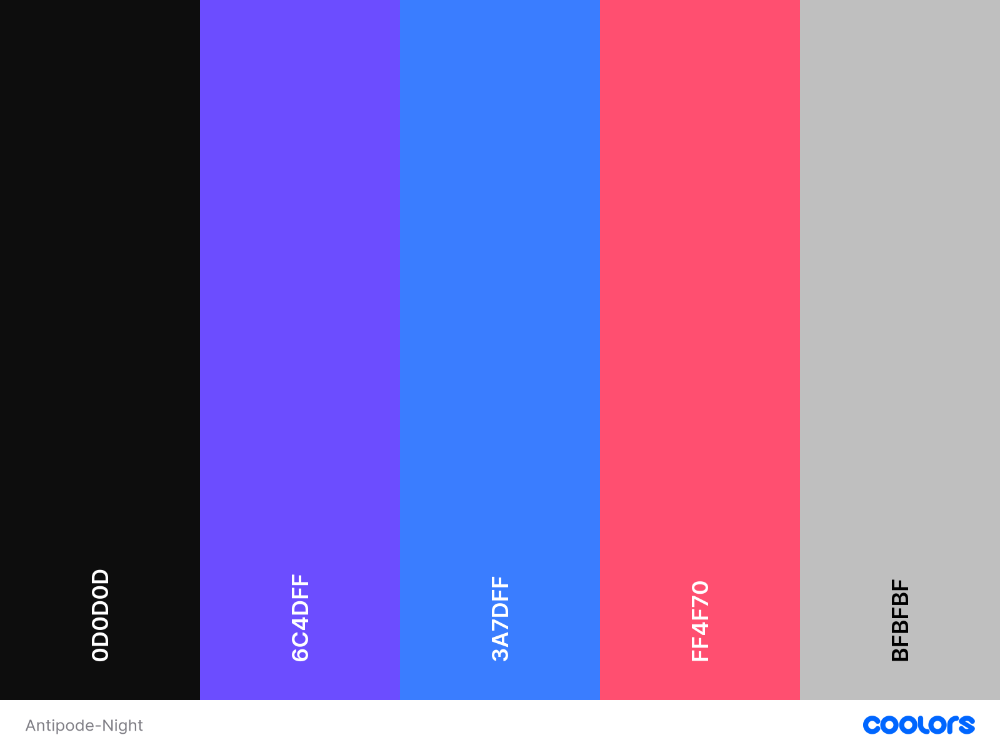

# UI Style Guide  

---

# 1. Brand Identity

## 1.1 Brand Concept
DayDreamNight (DDN) represents **global connection, antipode (day/night duality), and authentic real‑moment sharing**.

Brand Keywords:  
- 🌍 Global  
- 🌙 Duality (Day/Night)  
- 🎥 Authentic  
- ✨ Minimal & Warm  

---

# 2. Color System

DDN uses a **dual Day/Night theme**, with consistent brand colors.

---

## 2.1 Day Mode Palette

| Role | Hex | Description |
|------|-----|-------------|
| Primary Blue | **#3A7DFF** | Primary brand color for actions |
| Background Light | **#EEF4FF** | Clean background for video focus |
| Neutral Line | **#DDE1E8** | Dividers, strokes |
| Highlight Yellow | **#FFD86B** | Share, highlight |
| Text Primary | **#4A4A4A** | High readability |
| Text Secondary | **#808080** | Description, timestamps |



---

## 2.2 Night Mode Palette

| Role | Hex | Description |
|------|-----|-------------|
| Background Dark | **#0D0D0D** | Immersive dark UI |
| Midnight Purple | **#6C4DFF** | Night accent + gradient |
| Primary Blue | **#3A7DFF** | Shared brand color |
| Accent Red | **#FF4F70** | Likes, strong emphasis |
| Text Light | **#FFFFFF** | Main text |
| Text Secondary | **#BFBFBF** | Subtle description |



---

## 2.3 Gradient Styles

**Day:**  
```
linear-gradient(180deg, #EEF4FF 0%, #DDE1E8 100%);
```

**Night:**  
```
linear-gradient(180deg, #0D0D0D 0%, #1A1A1A 100%);
```

---

# 3. Typography

### Primary Font
- Inter  
- Alternatives: Noto Sans, Roboto

### Font Scale

| Type | Size | Weight | Use |
|------|------|--------|-----|
| H1 | 28px | 700 | Page titles |
| H2 | 22px | 600 | Section headers |
| Body 1 | 16px | 500 | Main text |
| Body 2 | 14px | 400 | Secondary text |
| Caption | 12px | 400 | Timestamp, meta info |

---

# 4. Spacing & Layout

Uses **8px grid spacing system**.

| Token | Value |
|-------|--------|
| XS | 4px |
| S | 8px |
| M | 16px |
| L | 24px |
| XL | 32px |
| XXL | 48px |

Examples:  
- Page side padding: 24px  
- Video card spacing: 16px  

---

# 5. Corners & Shadows

### Rounded Corners
- Buttons: 12px  
- Cards: 12–16px  
- Input fields: 10px  
- Icon buttons: 50% (circular)

### Shadows (Day mode)
```
0px 2px 8px rgba(0,0,0,0.08)
```

Night mode → use soft borders instead:
```
1px solid rgba(255,255,255,0.08)
```

---

# 6. Iconography

- Style: Rounded line icons  
- Sizes:
  - Navigation: 28px  
  - Action icons: 20–24px  
  - Header icons: 24px  

Colors:  
- Day: #3A7DFF, #4A4A4A  
- Night: #FFFFFF (70% opacity)

---

# 7. Components

---

## 7.1 Buttons

### Primary Button
- Background: **#3A7DFF**
- Text: **#FFFFFF**
- Radius: 12px
- Hover: **#2E63CC**

### Secondary Button
- Background: Day: #EEF4FF / Night: #1A1A1A  
- Border: 1px solid #3A7DFF  
- Text: #3A7DFF  

---

## 7.2 Video Card

- Aspect ratio: **9:16**
- Radius: 16px  
- Controls overlay: Black 40% opacity  
- Icons: White (Night) / Dark Gray (Day)

---

## 7.3 Bottom Navigation

- Icon size: 28px  
- Active: #3A7DFF  
- Inactive: Gray 600 (Day) / Gray 400 (Night)  
- Label text: 12px  

---

## 7.4 Chat Bubbles

### User (Right)
- Background: **#3A7DFF**  
- Text: white  
- Radius: 12px (right-bottom corner sharp)

### Friend (Left)
- Day: #F1F3F5  
- Night: #1A1A1A  
- Radius: 12px  

---

## 7.5 Input Field

| Mode | Background | Text |
|------|------------|-------|
| Day | #FFFFFF | #4A4A4A |
| Night | #1A1A1A | #FFFFFF |

Height: 44px  
Radius: 10px  

---

# 8. Accessibility (A11y)

- Contrast meets WCAG AA/AAA  
- Minimum target size: **48×48 px**  
- All icons have alt labels  
- Motion duration < 300ms  
- Color-blind safe combinations (Protanopia/Deuteranopia)

---

# 9. Internationalisation (i18n)

- Chinese ↔ English toggle  
- Localised timestamps (12h/24h)  
- Multi-length text expansion  
- International place names supported (“成都 / Chengdu”)

---

# End of Style Guide
# Document Status
**Version:** Sprint 1  
**Author:** Group 12 — Jiacheng Li 
**Status:** Approved for Sprint 2 development