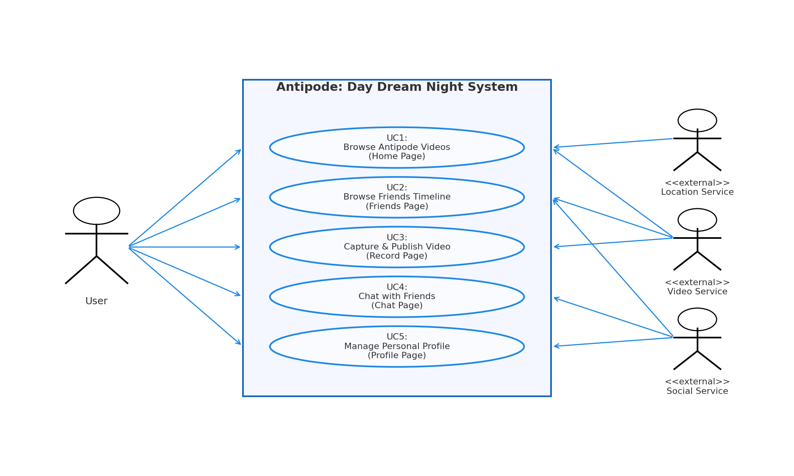

# Use Cases — DayDreamNight (Five Pages)

---

## UC1 — Browse Antipode Videos (Home Page)

**Description:**  
Users browse daily videos from their antipodal location by swiping up/down. The app automatically calculates the antipode based on the user's current location and displays real-time video content from that region. Users can like, comment, share videos, and view the uploader's profile.

**Key Interactions:**
- Vertical swipe: navigate between videos
- Swipe left: jump to uploader's profile
- Tap like icon: register a like
- Tap comment: open comment panel
- Tap share: share to external platforms or friends
- Display user avatar, nickname, timestamp, and antipode location indicator

**Visual Elements:**
- Full-screen video playback
- Overlay action buttons (like, comment, share)
- User info badge (lower-left)
- Day/night visual metaphor

---

## UC2 — Browse Friends Timeline (Friends Page)

**Description:**  
Users view a chronological timeline of videos from followed users and friends. Each post displays a thumbnail, timestamp, username, and caption. Users can tap a thumbnail to play the video, or interact via likes and comments from the timeline view.

**Key Interactions:**
- Scroll vertically through the timeline
- Tap thumbnail: open full-screen video player
- Tap like: register a like
- Tap comment: add a comment
- Jump to user profile by tapping username

**Visual Elements:**
- Thumbnail grid or list layout
- Post metadata (time, user, caption)
- Like/comment count badges
- Time-ordered sorting

---

## UC3 — Capture and Publish Video (Record Page)

**Description:**  
Users record a short video (up to 10 seconds per day), apply basic edits (tags, text, filters), and publish it to their profile. The Record page provides a camera preview with front/back toggle, a record button with countdown, a preview pane, and metadata input fields.

**Key Interactions:**
- Toggle between front and back camera
- Tap record button to start/stop (10s limit with visual timer)
- Preview recorded video
- Add title, tags, description
- Apply optional filters or effects
- Upload/save to profile
- View confirmation of successful upload

**Visual Elements:**
- Live camera preview (center)
- Record button with countdown
- Front/back camera toggle
- Filter selector
- Metadata input fields
- Upload progress indicator

---

## UC4 — Chat with Friends (Chat Page)

**Description:**  
Users communicate with friends or mutually-followed contacts via text messages, emojis, links, and video shortcuts. The Chat page displays a list of recent conversations and an expanded chat view with message history, timestamps, and real-time delivery indicators.

**Key Interactions:**
- View list of active chats
- Tap a chat to open conversation
- Type and send text messages
- Send emojis and stickers
- Share links or video shortcuts
- Receive real-time message updates
- Back navigation to chat list

**Visual Elements:**
- Chat list with recent contacts
- Conversation view with message bubbles
- Timestamp and read/unread indicators
- Message input bar with emoji/attachment buttons
- User avatars and names

---

## UC5 — Manage Personal Profile (Profile Page)

**Description:**  
Users manage and display their personal profile: avatar, display name, and bio. They can view all videos they have published (sorted by date), pin important videos to the top, and see counts of followers and following. The profile also displays a "Today's Video" section highlighting the most recent upload.

**Key Interactions:**
- Edit avatar, nickname, and bio
- View "Today's Video" section (most recent upload)
- Browse video gallery/archive (grid or list)
- Tap video to preview or delete
- Long-press to pin/unpin video to top
- View follower and following counts
- Navigate to follower/following lists

**Visual Elements:**
- Profile header (avatar, name, bio, stats)
- "Today's Video" highlight section
- Video gallery grid
- Pin/unpin toggle
- Edit profile button

---

## Summary

These five use cases cover the core features of **Antipode: DayDreamNight**:

1. **Home** — Discover videos from the opposite side of Earth
2. **Friends** — Stay connected with your social circle
3. **Record** — Share your own daily moment
4. **Chat** — Communicate in real-time
5. **Profile** — Manage your personal presence

Each page is designed to support both casual browsing and meaningful interaction, with attention to accessibility and touch-friendly controls.

---

## Document Status
**Version:** Sprint 2  
**Author:** Group 12 — Jiacheng Li 
**Status:** Approved for Sprint 3 development